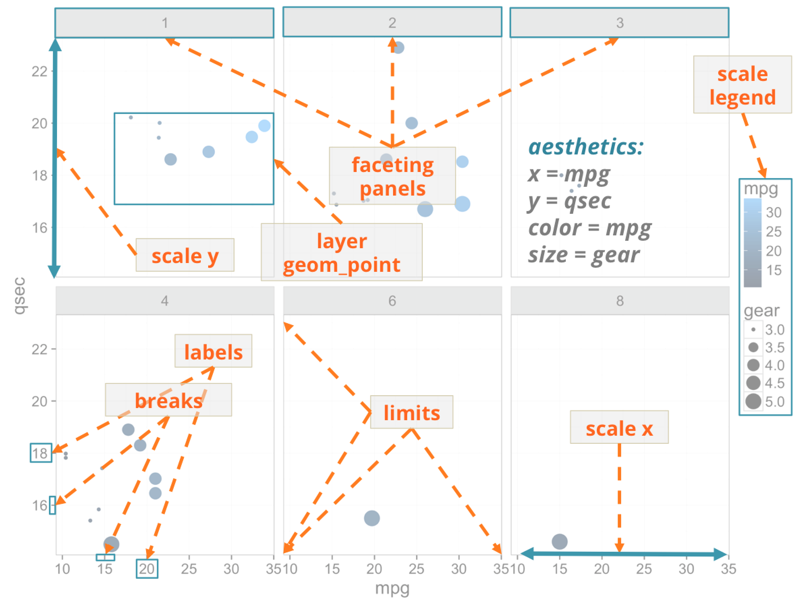
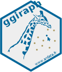

```{r setup, include=FALSE, message = FALSE, warning = FALSE}
knitr::opts_chunk$set(echo = TRUE, message = FALSE, warning = FALSE, fig.width = 6, fig.height = 5)
library(dplyr)
library(ggplot2)
library(ggiraph)
library(tidyr)
library(ggdendro)
library(readxl)
library(stringi)
library(widgetframe)

mytheme <- theme_minimal()
mytheme <- mytheme + theme( plot.caption = element_text(size = 6) )
theme_set(mytheme)
```

# About me

<div style="font-family:Lobster;padding:30pt;text-align:center;font-size:40pt;color:#AA9961;">freelanceR based in Paris.</div>

*When possible, I am open-sourcing...*


---
# Goal

<div class="listwithicon">
<ul>
<li><strong>Quickly publish on web ggplot2 outputs</strong></li>
<li><strong>With basic animations</strong></li>
<li><strong>And shiny interactivity</strong></li>
</ul>
</div>

An htmlwidget extending [ggplot2](https://CRAN.R-project.org/package=ggplot2) with D3.js (version 4) and package [rvg](https://CRAN.R-project.org/package=rvg).


---


# `ggplot2` graphics

*gg*: grammar of graphics

*“The Grammar of Graphics” from Wilkinson, Anand et Grossman (2005)*

--

ggplot2 is separating : 

* data

--

* coordinates system

--

* graphical elements (points, polygons, etc.)

--

graphical elements are on layers. Layers are superposed with `+` operator. 


---
class: middle



---

# An example code

```{r tidy=FALSE}
library(ggplot2)
gg <- ggplot(iris, aes(x = Sepal.Length, y = Petal.Length) ) + 
  geom_point(colour = "red", size = 3)
print(gg)
```

---

# An example code

```{r}
library(ggiraph)
gg <- ggplot(iris, aes(x = Sepal.Length, y = Petal.Length, 
    tooltip = Species, data_id = Species )) + 
  geom_point_interactive(colour = "red", size = 3 )
```
```{r eval=FALSE}
ggiraph(ggobj = gg)
```

---
```{r echo=FALSE}
ggiraph(ggobj = gg, width = 1, width_svg = 5, height_svg = 3)
```


---
# Geoms aesthetics

<div style="font-family:Lobster;padding:30pt;text-align:center;font-size:50pt;color:#AA9961;">3 new parameters</div>

<div class="listwithicon">
<ul>
<li><code>tooltip</code></li>
<li><code>data_id</code>: id setter (hover effects and shiny interaction)</li>
<li><code>onclick</code>: click events</li>
</ul>
</div>

---

# Existing geoms

```{r echo=FALSE}
ul_ <- do.call(htmltools::tags$ul, objects(envir = as.environment("package:ggiraph"),
        pattern = "^geom") %>% purrr::map( htmltools::tags$li ) )
htmltools::div(class="listwithicon", ul_)
```

---
class: inverse, middle, center

# Create a dynamic map

---

## Data preparation

```{r}
map <- map_data("france")

legis_data <- read_excel("data/Leg_2017_Resultats_T1_c.xlsx", 
                 sheet = "Departements T1", skip = 1) %>% 
  transmute( cod_dep = `Code du département`, 
             lib_dep = stri_trans_general(`Libellé du département`, "Latin-ASCII"), 
             abs_ratio = `% Abs/Ins` ) %>% 
  mutate(lib_dep = case_when(lib_dep == "Cote-d'Or" ~ "Cote-Dor",
         lib_dep == "Cotes-d'Armor" ~ "Cotes-Darmor", lib_dep == "Corse-du-Sud" ~ "Corse du Sud",
         lib_dep == "Val-d'Oise" ~ "Val-Doise", lib_dep == "Corse-du-Sud" ~ "Corse du Sud", 
         TRUE ~ lib_dep))

result_map <- left_join(x = map, y = legis_data, by = c("region" = "lib_dep") )
head(result_map)
```

---

## `ggplot` creation

```{r}
title <- "Abstention rate"
subtitle <- "First round of legislative election - 2017"
caption <- "source: https://www.data.gouv.fr/fr/datasets/elections-legislatives-des-11-et-18-juin-2017-resultats-du-1er-tour"

fr_map <- ggplot(result_map, aes(long, lat, group = group, fill = abs_ratio) )

fr_map <- fr_map + 
  geom_polygon_interactive(mapping = aes(data_id = region, tooltip = abs_ratio), 
  colour = "white", size = .3) + 
  coord_map()

fr_map <- fr_map + 
  scale_fill_gradient(name = "", low = "#006699", high = "red", limits = c(40, 60) ) +
  labs(x = "", y = "", title = title, subtitle = subtitle, caption = caption)
```

---

## `ggplot` display

```{r}
print(fr_map)
```

---

## `ggplot` display using `ggiraph`

```{r eval=FALSE}
extra_css <- "background-color:#333333;font-style:italic;color:white;padding:10pt;"

ggiraph( ggobj = fr_map, 
         tooltip_extra_css = extra_css, 
         tooltip_offy = -20, 
         zoom_max = 3 )
```

---
```{r echo=FALSE}
extra_css <- "background-color:#333333;font-style:italic;color:white;padding:10pt;"
ggiraph(ggobj = fr_map, tooltip_extra_css = extra_css, tooltip_offy = -20, zoom_max = 3, width = 1, width_svg = 10, height_svg = 6)
```

---

# A dynamic heatmap


```{r echo=FALSE}
mydata <- cor(mtcars)

# dendrogram for rows
hc <- hclust(dist(mydata), "ave")
dhr <- as.dendrogram(hc)
order_r <- rownames(mydata)[hc$order]

# dendrogram for columns
hc <- hclust(dist(t(mydata)), "ave")
dhc <- as.dendrogram(hc)
order_c <- colnames(mydata)[hc$order]

# the data
expr_set <- bind_cols( data_frame(rowvar = rownames(mydata)),
  as.data.frame(mydata) )

expr_set <- gather(expr_set, colvar, measure, -rowvar)
expr_set$rowvar <- factor( expr_set$rowvar, levels = order_r )
expr_set$colvar <- factor( expr_set$colvar, levels = order_c )
expr_set <- arrange(expr_set, rowvar, colvar)

data_c <- dendro_data(dhc, type = "rectangle")
data_c <- segment(data_c) %>% mutate(
  y = y + length(order_r) + .5,
  yend = yend + length(order_r) + .5
)

data_r <- dendro_data(dhr, type = "rectangle")
data_r <- segment(data_r)
data_r <- data_r %>% mutate( x_ = y + length(order_c) + .5,
          xend_ = yend + length(order_c) + .5,
          y_ = x, yend_ = xend )

expr_set <- expr_set %>% 
  mutate( tooltip = sprintf("Row: %s<br/>Col: %s<br/>measure: %.02f", 
                            rowvar, colvar, measure) ,
    data_id = sprintf("%s_%s", rowvar, colvar)
    )

p <- ggplot(data = expr_set, aes(x = colvar, y = rowvar) ) +
  geom_tile_interactive(aes(fill = measure, tooltip = tooltip, 
                            data_id = data_id), colour = "white") +
  scale_fill_gradient2(low = "#BC120A", mid = "white", high = "#006699", limits = c(-1,1)) +
  geom_segment( data = data_c,
    mapping = aes(x = x, y = yend, xend = xend, yend = y),
    colour = "gray20", size = .2) +
  geom_segment( data = data_r,
    mapping = aes(x = x_, y = y_, xend = xend_, yend = yend_),
    colour = "gray20", size = .2) +
  coord_equal() + theme(
    panel.grid.minor = element_line(color = "transparent"),
    panel.grid.major = element_line(color = "transparent")
  )
p
```

---

```{r}
ggiraph(ggobj = p, width = 1, width_svg = 10, height_svg = 6)
```

---
class: center, middle, inverse

# Shiny interactivity


---
class: center, middle, inverse

## [Standard shiny example](http://127.0.0.1:12346)

```{r eval=FALSE, echo=FALSE}
Sys.setenv("RSTUDIO_PANDOC" = "/Applications/RStudio.app/Contents/MacOS/pandoc")
shiny::runApp("apps/treemap", port = 12346)
```

---
class: center, middle, inverse

## [flexdashboard example](http://127.0.0.1:12345/flexdashboard.Rmd)

Use arguments `flexdashboard = TRUE, use_widget_size = TRUE` when working with flexdashboard. 

```{r eval=FALSE, echo=FALSE}
Sys.setenv("RSTUDIO_PANDOC" = "/Applications/RStudio.app/Contents/MacOS/pandoc")
rmarkdown::run("apps/flexdashboard.Rmd", shiny_args = list(port = 12345))
```


---
## Shiny manipulations

ggiraphOutput has `outputId` **X**.

> How to get the selected id?

The reactive value is available in `input$X_selected`.

> How to set selected id from shiny?

```
session$sendCustomMessage(type = 'X_set', message = a_character_vector)
```

---

# Future

*Solve:*

<div class="listwithicon">
<ul>
<li>Windows and UTF8</li>
<li>Hover effect over duplicated ids</li>
</ul>
</div>

*Enhance:*

<div class="listwithicon">
<ul>
<li>highlight data series closest to the pointer</li>
<li>Rectangular zoom and selections</li>
<li>new geoms</li>
</ul>
</div>


---
class: center, middle, inverse

# More examples

---

## Interactive mekko charts 

Originally coded by Data-journalist [Duc Quang Nguyen](https://dqn.website/post/interactive-mekko-charts-in-r)

---

```{r echo=FALSE}
library(ggiraph)
library(tidyverse)
library(magrittr)

load_data <- readRDS("data/load_data.RDS") %>% 
  mutate(summary = case_when(
    summary %in% "original" ~ "valid",
    summary %in% "corrected" ~ "valid",
    TRUE ~ "invalid"
    )
  )

load_data <- load_data[-c(1:1000, 100000:102000),]

dat_analysis <- load_data %>% 
  group_by(country, summary ) %>%
  tally() %>% ungroup() %>%
  tidyr::complete(country, summary, fill = list(n=0) ) 


dat_analysis %<>% 
  group_by(country) %>% 
  mutate( proportion = n / sum(n), count = sum(n)) %>% 
  ungroup()

dat_analysis %<>% 
  group_by(summary) %>% 
  arrange(desc(country)) %>%
  mutate(
    ymax = cumsum(count) / sum(count), 
    ymin = (ymax - (count/sum(count)))
  ) %>% ungroup() %>% 
  group_by(country) %>% 
  arrange(desc(summary)) %>%
  mutate(xmax = cumsum(proportion), xmin = xmax - proportion) %>%
  ungroup() %>% 
  arrange(country)

dat_analysis %<>%
  mutate(
    data_id = paste0(summary, country),
    tooltip = paste0(
      "<em>", as.character(country), "</em><hr>",
      "<i>", summary, " proportion</i>: ", 
      round(proportion * 100, 1), "%<br>", "(",
      prettyNum(round(n), big.mark = " ", mode = "character"), " data points)"
    )
  )
# hack to escape single quote
dat_analysis %<>% mutate(tooltip = gsub("'", "&#39;", tooltip))

gp <- ggplot(dat_analysis) + 
  geom_rect_interactive(
    aes(ymin = ymin, ymax = ymax, xmin = xmin, xmax = xmax, 
        fill = summary, data_id = data_id, tooltip = tooltip), 
    colour = "white", size = 0.2)

labels <- dat_analysis %>% 
  filter(summary == "valid") %>%
  mutate(y = ymax - 0.01, yRange = (ymax - ymin)* 100) %>%
  select(country, xmin, y, yRange) %>% 
  ungroup()

value_labels <- dat_analysis %>% 
  select(country, summary, xmin, xmax, ymax, proportion) %>%
  mutate(
    x = ifelse(summary == "valid", xmax, xmin),
    y = ymax - 0.005,
    label = paste0(round(proportion * 100), "%"),
    hjust = ifelse(summary == "valid", 1.05, -0.25)
  ) 


gp2 <- gp + 
  geom_text(
    data = labels,
    aes(x = xmin + 0.008, y = y, label = as.character(country), size = yRange),
    hjust = 0, vjust = 1, colour = "white"
  ) +
  geom_text(
    data = value_labels,
    aes(x = x, y = y, label = label, hjust = hjust),
    vjust = 1, size = 2.7, alpha = 0.7, colour = "white"
  ) +
  scale_size_continuous(range = c(2.2, 4.5), guide = F)


gp3 <- gp2 +
  theme_minimal() +
  scale_x_continuous(
    position = "top", expand = c(0.01, 0.01), 
    labels = scales::percent, breaks = scales::pretty_breaks(n = 4)) +
  scale_y_continuous(
    expand = c(0,0), limits = c(0, 1.02)
  ) +
  scale_fill_manual(
    values = c(invalid= '#AA9961', valid = '#006699')
  ) +
  theme(
    axis.line.x = element_blank(),
    axis.text.y = element_blank(),
    axis.title = element_blank(),
    plot.subtitle = element_text(face = "italic", colour = "gray"),
    plot.caption = element_text(face = "bold.italic", colour = "gray"),
    legend.position = "none"
  ) + labs(title = "ENTSOE quality summary", 
           subtitle = "interactive mekko charts",
           caption = "stoolen and adapted from https://dqn.website/post/interactive-mekko-charts-in-r/")

ggiraph({print(gp3)}, width = 1, width_svg = 10, height_svg = 6, 
        hover_css = "fill:#FF0000;cursor:pointer;",
        tooltip_extra_css = "background-color: white;padding:5pt;") %>% 
  widgetframe::frameWidget()
```


---

## Interactive bar charts 

<script>
var coincoin = new Audio("./libs/media/Duck.ogg" ) ;
var ouahouah = new Audio("./libs/media/Sound-of-dog.ogg" ) ;
var meow = new Audio("./libs/media/Meow.ogg" ) ;
</script>

```{r echo=FALSE}
library(ggiraph)
library(tidyverse)
data <- readxl::read_excel("data/cats-vs-dogs.xlsx") %>% 
  select(Location, `Percentage of Dog Owners`, `Percentage of Cat Owners`) %>% 
  set_names( c( "location", "dog", "cat") ) %>% 
  gather(animal, percentage, -location) %>% 
  mutate(clickjs = case_when(
    animal %in% "dog" ~ "ouahouah.play();",
    animal %in% "cat" ~ "meow.play();",
    TRUE ~ "coincoin.play();"
  ), data_id = paste0(location, animal) )

gg <- ggplot( data = data, aes(x = location, y = percentage, fill = animal, onclick = clickjs, data_id = data_id ) ) + 
  geom_bar_interactive(stat = "identity") + theme_minimal() +
  scale_fill_manual(values = c("#4477AA", "#CC6677") ) + 
  theme(axis.text.x = element_text(angle = 45, hjust = 1))
  
ggiraph(ggobj = gg, hover_css = "cursor:pointer;", width = 1, width_svg = 10, height_svg = 4 )
```


---

# Ressources



website: [davidgohel.github.io/ggiraph](https://davidgohel.github.io/ggiraph)

stackoverflow: [tag ggiraph](https://stackoverflow.com/questions/tagged/ggiraph)

```{r}
list.files(system.file(package = "ggiraph", "shiny"))
```

---
class: inverse, center, middle


# Thank you, any question?
